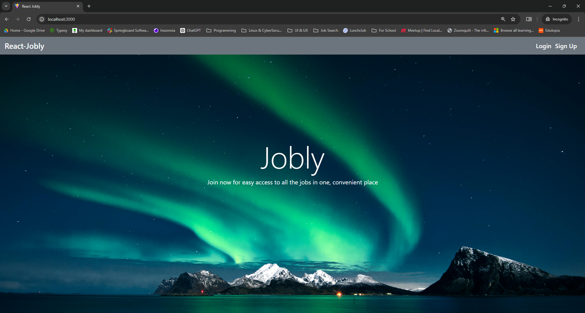

# React-Jobly

## About
React-Jobly, Jobly for short, is a SQL-driven mock job board intended to practice and exhibit my skills in React, as part of the Springboard Software Engineering Career Track curriculum.\
Jobly's back end is programmed using Express.js and node, while its front end is written in Typescript, and set up using Vite. Testing done with Vitest. Bootstrap was also used to help style the pages.\
Try it out at: https://jobly-frontend-mfbl.onrender.com/

**Test username**: testuser\
**Test password**: password

## Features
* View companies
    * Filter by name, minimum number of employees, and maximum number of employees
* View jobs
    * Filter by job title, minimum salary, and whether the job offers equity
* Create an account to access the above features
    * Able to change user's own information (first name, last name, email)
* Apply for jobs after creating an account

## Setup & Usage
Clone this repo locally and then run npm install in the root folder.\
Optionally change the port that the front end server runs on in `./vite.config.ts`.\
To Run, execute `npm run dev` in the root directory.

## Testing
Tests on the frontend are written in typescript and use Vitest, while the backend uses jest normally.\
Conduct tests by running `npm run test` in frontend folder for the front end tests and the same command in the backend folder for back end tests.
